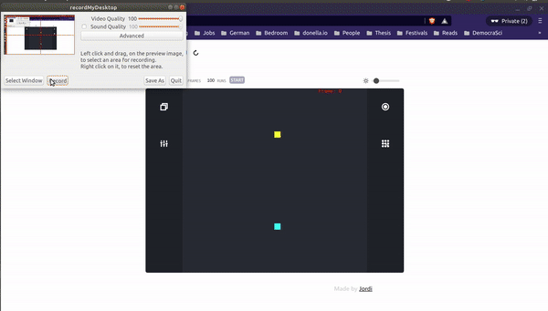

# Antwork:

Welcome! Antwork is a brownian agent simulation tool that was developed in the context of a Semester Project during my Masters.

## Preview



## Folder Structure

├── build  
├── public  
├── src  
│..├── Documentation # Contains text and images that are rendered on the about page.</br>
│..└── Simulation</br>
│....├─── context # Provides the context for the interface</br>
│....└─── logic # Contains the logic of the simulation</br>
└── ...

## Simulation engine starting template

The scripts used to run the simulation engine are located in `src/Simulation/logic`.

```js
const nodes = new Nodes().default();

const envir = new Environment({
	alpha: 1,
	k: 0.03,
	beta: 0.2,
	epsilon: 0.5,
	s0: 10000,
	framerate: 1,
	layout: {},
	nodes,
});

const walkers = new WalkingSquad(500, envir, "rand", "rand", 0);
const database = new Database("Walker Metrics");
const analysis = new Analysis(envir, walkers, nodes, database);
const engine = new Engine(envir, walkers, "euler", database, analysis);

engine.running = true;

for (var i = 0; i < 100; i++) {
	engine.next(); // Advances the simulation by a single step
	analysis.run(); // Computes metrics on the existing fields
}
```

## Running the interactive dashboard

### Installation

1. Check if nodejs is installed.

```bash
node -v
```

If not you can install from [here](https://nodejs.org/en/).

2. Install yarn package manager

```bash
npm install --global yarn
```

### Getting started

To run the dashboard with the interactive visualization

```bash
yarn install
yarn start
```

## Author

Jordi Campos: MSc Physics at the ETH Zurich.

# License

MIT LICENSE
